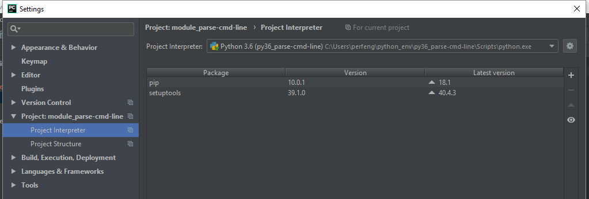
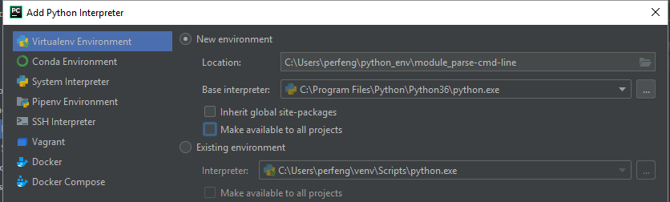
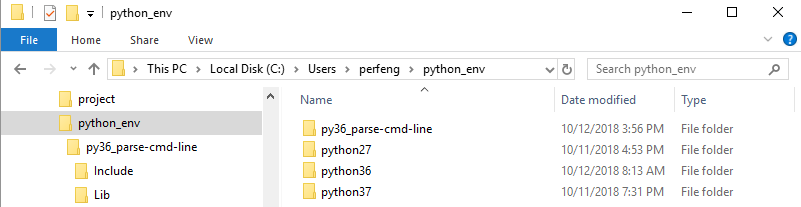
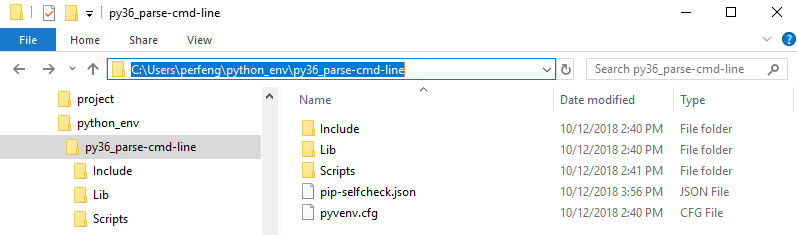

# Virtual Environments
To solve module dependency for hosting multi python applications that need different versions of module. The solution for this problem is to create a virtual environment, a self-contained directory tree that contains a Python installation for a particular version of Python, plus a number of additional packages.
Different applications can then use different virtual environments.

## Getting Started

These instructions is based on windows

### Current

Current environment has python 3.7.0. Pip listed current installed package

```
PS C:\Users\perfeng\python_env> python -V
Python 3.7.0
PS C:\Users\perfeng\python_env> pip list
Package    Version
---------- -------
pip        10.0.1
setuptools 39.0.1
```

### Installing (Create Virutal Environments)

Let's say I want to install a few different packages in python 2.7 (v2.7.15) instead of default python 3.7 (v3.7.0)

```
windows: (in linux: 'python3 -m venv python27')

Option 1) using 'virtualenv' to create a virtual environment:
PS C:\Users\perfeng\python_env> pip install virtualenv
Collecting virtualenv
Successfully installed virtualenv-16.0.0

PS C:\Users\perfeng\python_env> pip list
Package    Version
---------- -------
pip        10.0.1
setuptools 39.0.1
virtualenv 16.0.0

# virtualenv -p allows you to specify the Python interpreter to use. The default is the interpreter that virtualenv was installed with (c:\program files\python\python37\python.exe)
C:\Users\perfeng\python_env>virtualenv -p "C:\Program Files\Python\Python27\python.exe" python27_demo

---
Option 2) running the venv module as a script with the directory path:
& 'C:\Program Files\Python\Python36\python.exe' -m venv python36_demo_option2

```

List out contents of python27_demo virtual environment after v2.7 environment gets created

```
Directory: C:\Users\perfeng\python_env\python27_demo

Mode                LastWriteTime         Length Name
----                -------------         ------ ----
d-----       10/11/2018   2:18 PM                Include
d-----       10/12/2018  10:32 AM                Lib
d-----       10/12/2018  10:32 AM                Scripts
d-----       10/12/2018  10:31 AM                tcl
-a----       10/12/2018  10:32 AM             59 pip-selfcheck.json
```

## Activate/deactivate the environment (working in isolations)

Activate previous created python v2.7.15 environment

### activate

Windows: virtual-environment\Scripts\activate.bat
Linux: source virtual-environment/Scripts/activate

once you have activate the virtual-environment, you will see the environment name prefix like '(python27_demo)'
```
PS C:\Users\perfeng\python_env> .\python27_demo\Scripts\activate
(python27_demo) PS C:\Users\perfeng\python_env>
```

### check python version

They are all in v2.7

```
(python27_demo) PS C:\Users\perfeng\python_env> python -V
Python 2.7.15
(python27_demo) PS C:\Users\perfeng\python_env> pip -V
pip 18.1 from c:\users\perfeng\python_env\python27_demo\lib\site-packages\pip (python 2.7)
```

### pip list 
Note - since you are in python 27 virtual environment, there is no previous installed 'virtualenv 16.0.0' in default enviroment(v3.7.0)
```
(python27_demo) PS C:\Users\perfeng\python_env> pip list
Package    Version
---------- -------
pip        18.1
setuptools 40.4.3
wheel      0.32.1

V.S. (In default v3.7.0)

PS C:\Users\perfeng\python_env> pip list
Package    Version
---------- -------
pip        10.0.1
setuptools 39.0.1
virtualenv 16.0.0

```

### deactivate
To get out of current virtual enviroment
```
(python27_demo) PS C:\Users\perfeng\python_env> deactivate
PS C:\Users\perfeng\python_env> python -V
Python 3.7.0
```

## IDE (Pycharm)
Create virtual enviroment in IDE





## Note
* You should never put project files in virtual enviroment. Vitual enviroment is only meant to sepearte out the packages, dependencies and verions you are going to use from projects to projects

## Reference

* [Virtual Environments and Packages](https://docs.python.org/3.7/tutorial/venv.html#creating-virtual-environments) - Python official tutorial
* [Youtube](https://www.youtube.com/watch?v=N5vscPTWKOk) - Python Tutorial: virtualenv and why you should use virtual environments


